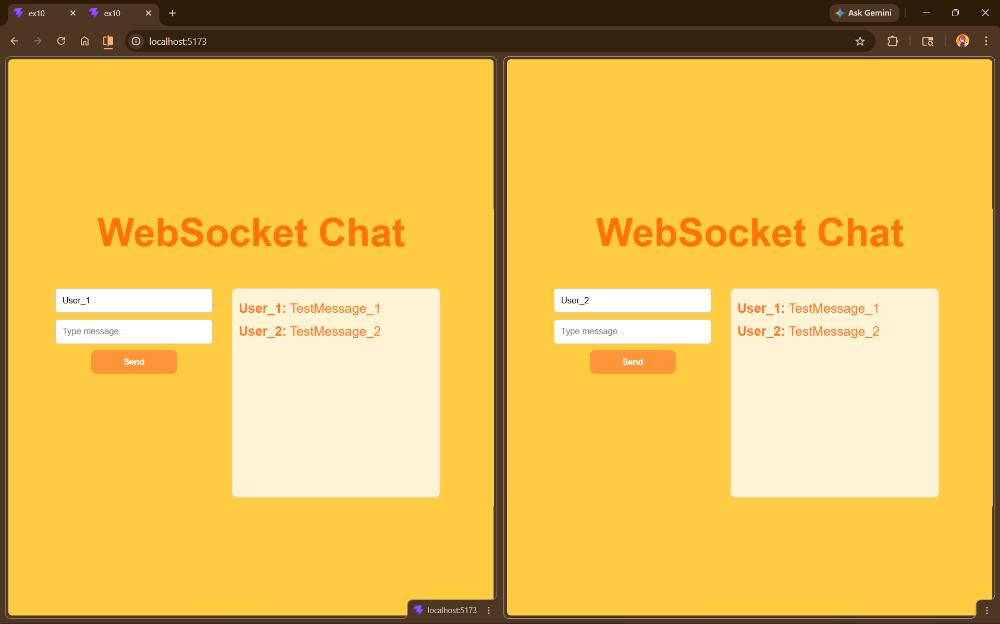
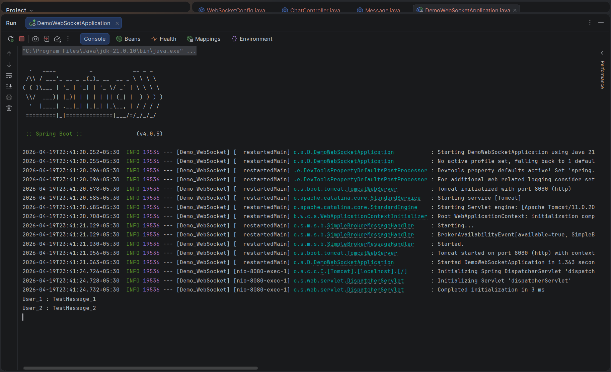

# Experiment-10: WebSocket Chat Application

## Aim
- To build a **full-stack real-time chat application** using WebSocket technology.
- To enable bidirectional communication between client and server without HTTP polling.
- To implement real-time message broadcasting to multiple connected users.
- To develop a responsive and modern UI using React.
- To configure and handle WebSocket connections using Spring Boot.


## Tools & Libraries
- **Spring Boot** (WebSocket, Messaging)
- **Spring WebSocket** (STOMP protocol support)
- **React 18** (Frontend library)
- **Vite** (Frontend build tool)
- **SockJS** (WebSocket fallback support)
- **STOMP.js** (Messaging over WebSocket)
- **Maven** (Build tool with Wrapper)
- **Java** 17+

## Project Structure

```
Exp10/
├── Demo_WebSocket/
│   ├── .mvn/
│   ├── src/
│   │   ├── main/
│   │   │   ├── java/com/aml2b/Demo_WebSocket/
│   │   │   │   ├── Config/
│   │   │   │   │   └── WebSocketConfig.java
│   │   │   │   ├── Controller/
│   │   │   │   │   └── ChatController.java
│   │   │   │   ├── Model/
│   │   │   │   │   └── Message.java
│   │   │   │   └── DemoWebSocketApplication.java
│   │   │   └── resources/
│   │   └── test/java/com/aml2b/Demo_WebSocket/
│   ├── .gitignore
│   ├── mvnw
│   ├── mvnw.cmd
│   ├── pom.xml
│   └── target/
│
└── ex10/
    ├── node_modules/
    ├── public/
    ├── src/
    │   ├── assets/
    │   ├── Components/
    │   │   ├── Chat.jsx
    │   │   ├── MessageInput.jsx
    │   │   └── MessageList.jsx
    │   ├── App.css
    │   ├── App.jsx
    │   ├── index.css
    │   └── main.jsx
```

## Description

### Core Features

#### 1. **Real-Time Messaging**
- Enables instant communication between users using WebSocket.
- Messages are broadcast to all connected clients without delay.
- Eliminates the need for repeated API polling.

#### 2. **WebSocket Configuration**
- Configured using Spring Boot with STOMP protocol.
- Defines endpoint for client connection (e.g., `/ws`).
- Supports cross-origin requests for frontend integration.
- Uses message broker for routing messages (`/topic`, `/app`).

#### 3. **Message Handling**
- `ChatController` handles incoming messages from clients.
- Messages are mapped using `@MessageMapping`.
- Broadcasts messages using `@SendTo` to subscribed clients.
- Ensures structured communication using a message model.

#### 4. **Frontend Interaction**
- React app connects to backend via SockJS + STOMP.
- Maintains WebSocket connection state.
- Sends messages and listens for incoming updates.
- Dynamically updates UI without page reload.

#### 5. **Message Model**
- Simple structure containing:
  - Sender name
  - Message content
- Used for consistent data transfer between frontend and backend.

#### 6. **Connection Management**
- Detects connection and disconnection events.
- Displays connection status in UI.
- Handles errors when backend is unreachable.


## Screenshots



