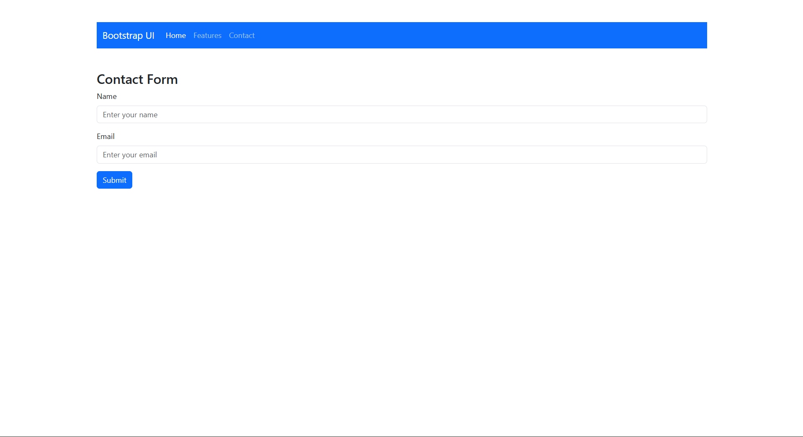
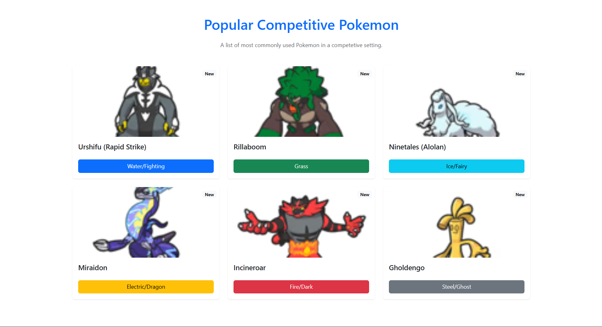
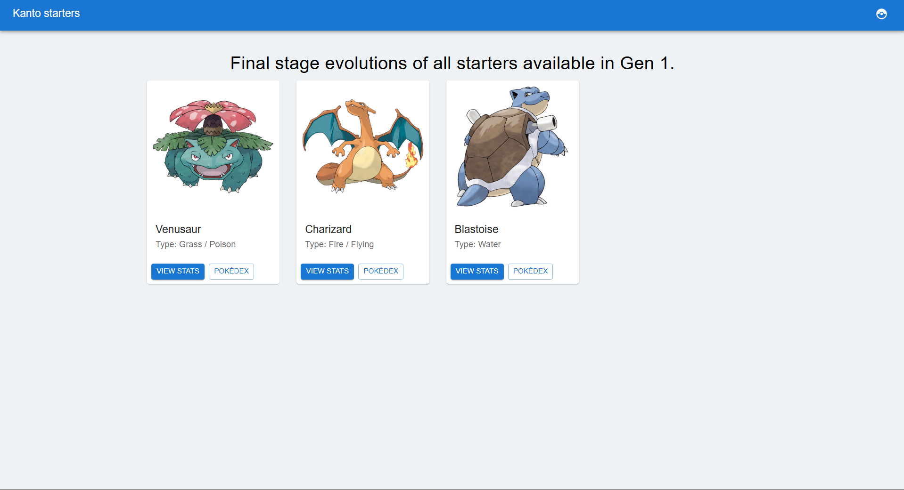
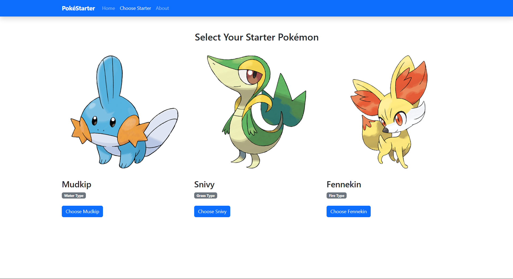

# Experiment 2: UI Design Using Material UI & Bootstrap

## Aim
To design a React application using **Material UI** and **Bootstrap** components.

## Tools & Libraries
- React (Vite)
- Bootstrap
- React-Bootstrap
- Material UI (@mui/material)

## Description
This project demonstrates a single React application that includes:
- A **Bootstrap Navbar**
- A **Bootstrap Form**
- A **Material UI Form**
- **Material UI Card components**

All components are organized into separate folders and rendered together in one application.

## Screenshots

### Experiment 2.1

### Experiment 2.2

### Experiment 2.3

### Experiment 2.4

## How to Run
```bash
npm install
npm run dev