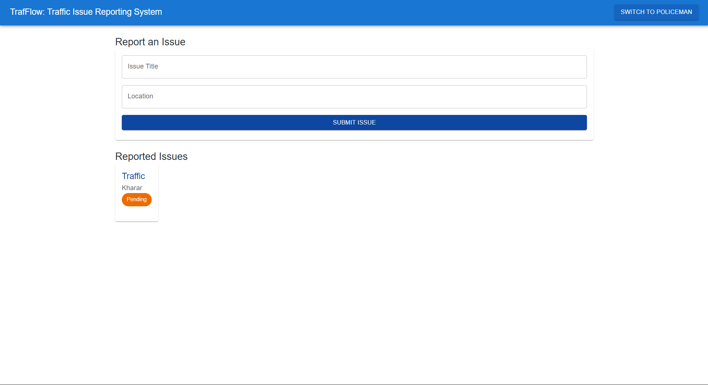
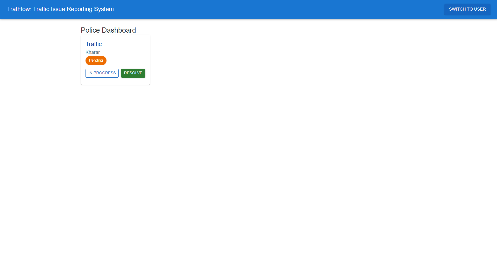
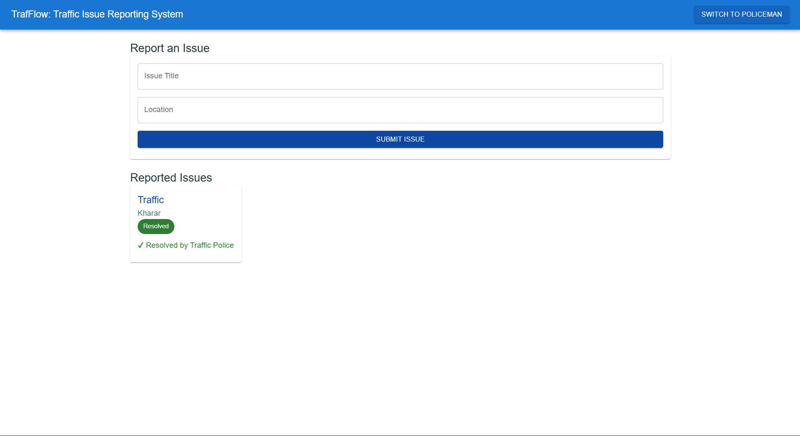

# Smart Traffic & Road Issue Reporting System 🚦

Road problems such as potholes, broken signals, and damaged streets often remain unresolved due to the lack of a simple reporting system. This leads to traffic delays, accidents, and unsafe travel conditions.

This project provides a web platform where citizens can easily report traffic and road-related issues in their area. The collected reports help highlight problem locations and support quicker action to improve road safety.

## 🧩 Problem
- Road and traffic issues are reported late or ignored  
- No single platform to track and organize complaints  
- Increased safety risks due to unattended issues  

## 💡 Solution
- Easy reporting of road and traffic problems  
- Organized view of reported issues by location  
- Simple and user-friendly design  

## 🎯 Goal
To encourage public participation and contribute to safer, better-managed roads.

---

A small step toward smarter and safer cities.

## Screenshots:

