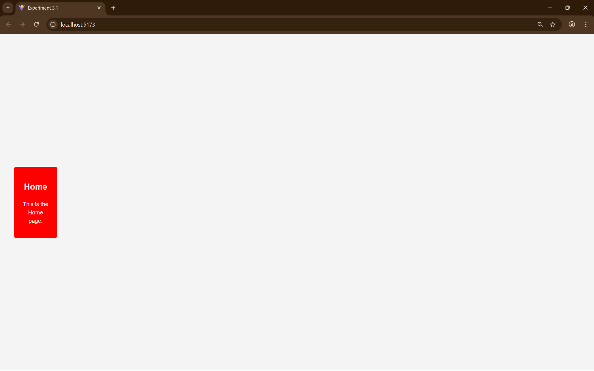
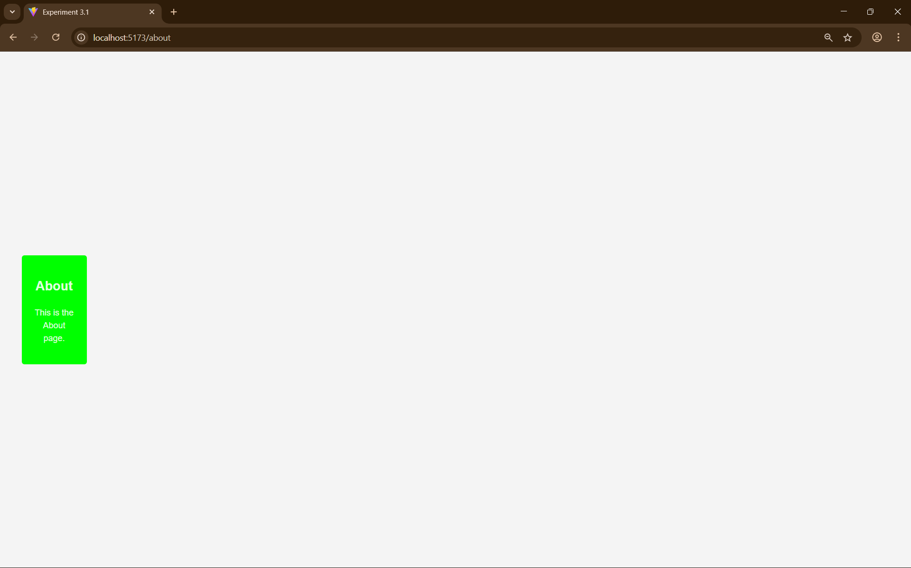
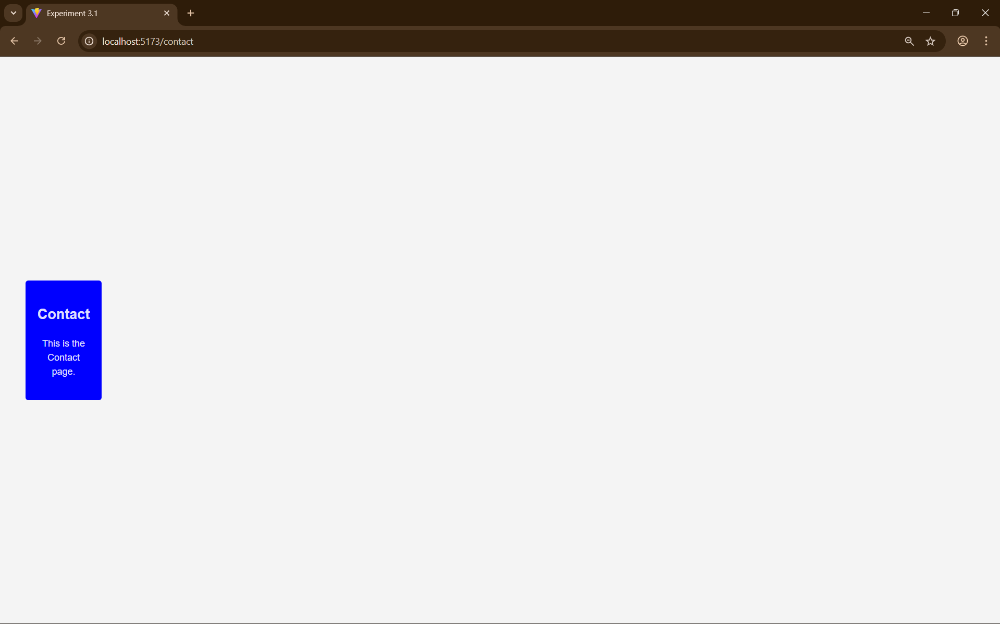
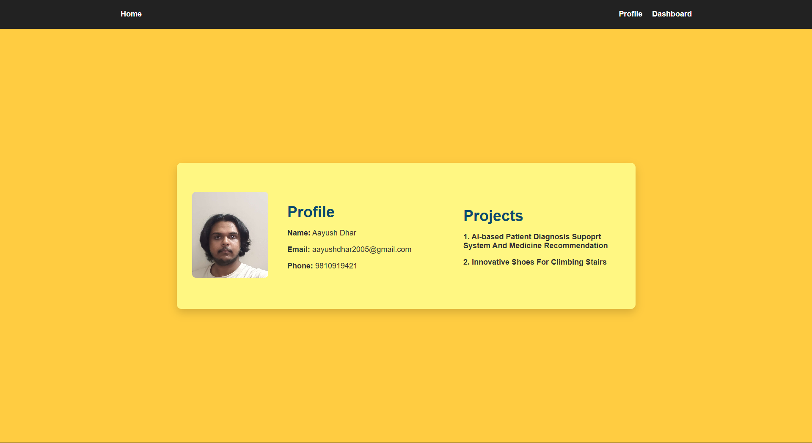
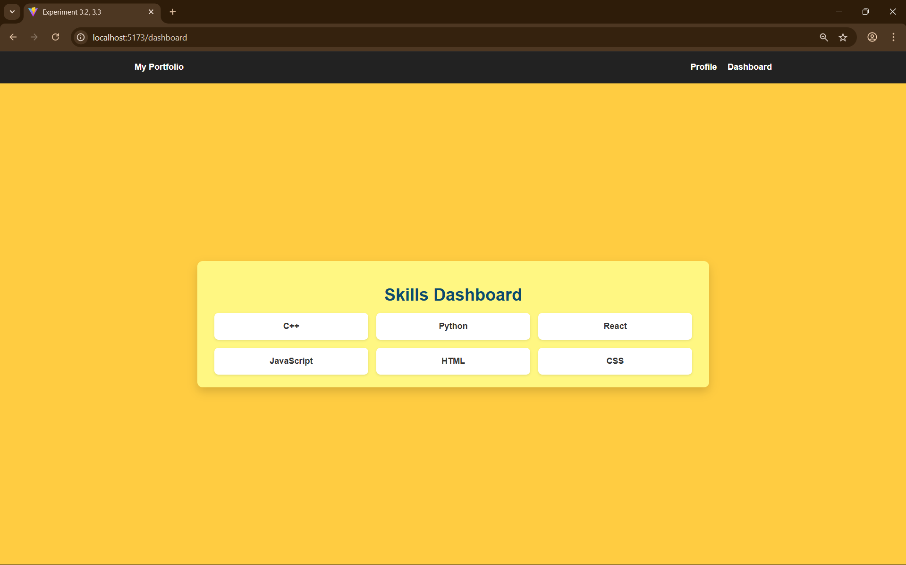

# Experiment 3: Implementing Routing in Single Page Applications (SPA).

## Aim
To design a React application using *React-Router-Dom* and *Routing* components.

## Tools & Libraries
- React (Vite).
- React Router.

## Description

This project demonstrates a Single Page Application that involves:

- A *Navbar*.
- A *Profile* page.
- A *Dashboard* page.
- *Corresponding buttons to switch between them*.

## Screenshots

### Experiment 3.1

### Experiment 3.2, 3.3

