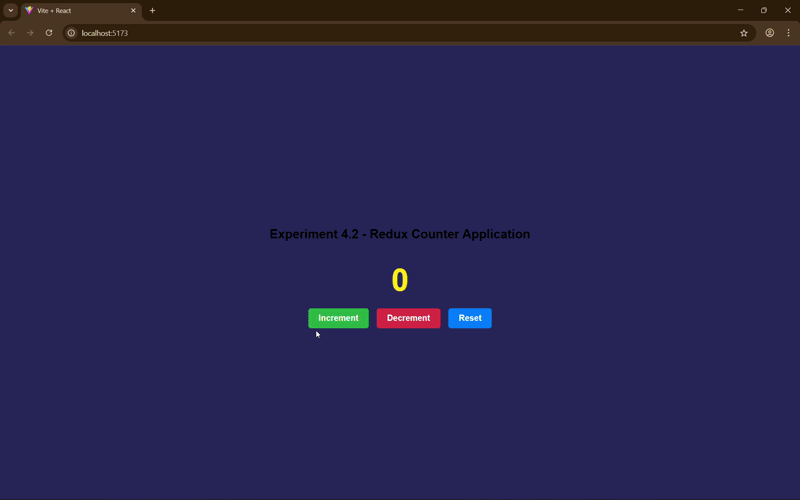

# Experiment 4: State Management using React Contact API and Redux.

## Aim
To implement global state management in a Single Page Application using the React Conttext API.
To implement centralized state management using Redux in a React application.

## Tools & Libraries
- React (Vite).
- React Context API
- React-Redux
- Redux Toolkit

## Description

### Experiment 4.1

This project demonstrates Global State Management using the React Context API that involves:

- Creating a global context using createContext().

- Wrapping the application with a Context Provider.

- Managing a global Theme Toggle (Light/Dark mode).

- Accessing and updating global state using useContext() without prop drilling.

### Experiment 4.2

This project demonstrates centralized state management using Redux Toolkit that involves:

- Creating a Redux store using configureStore().

- Defining a slice with actions and reducers using createSlice().

- Implementing a Counter Application.

- Updating state using useDispatch().

- Accessing state using useSelector().

## Screenshots

### Experiment 4.1

### Experiment 4.2

