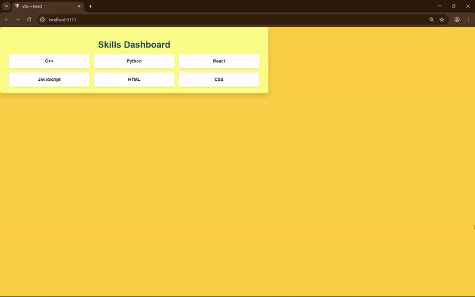
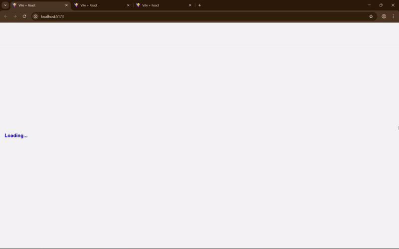

# Experiment 5: Optimize Frontend Performance using Lazy Loading    .

## Aim
To optimize frontend performance by implementing lazy loading of components in a Single Page Application (SPA) using React.lazy and Suspense.

## Tools & Libraries
- React (Vite).
- React Router.
- React.lazy
- Suspense

## Description

### Experiment 5.1

This project demonstrates a Single Page Application that involves:

- A *Dashboard* page.
- A "Loading...." text that comes up on refreshing the SPA.

### Experiment 5.2

This project demonstrates route-based Lazy Loading that involves:
- A *Home* page.
- An *About* page.
- A *Contact* page.
- A "Loading...." text that comes up on refreshing the SPA.

## Screenshots

### Experiment 5.1

### Experiment 5.2

