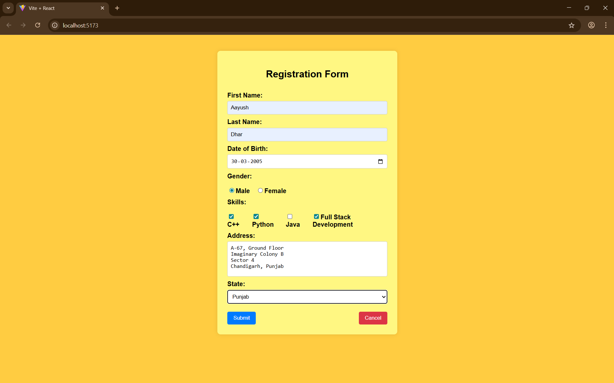
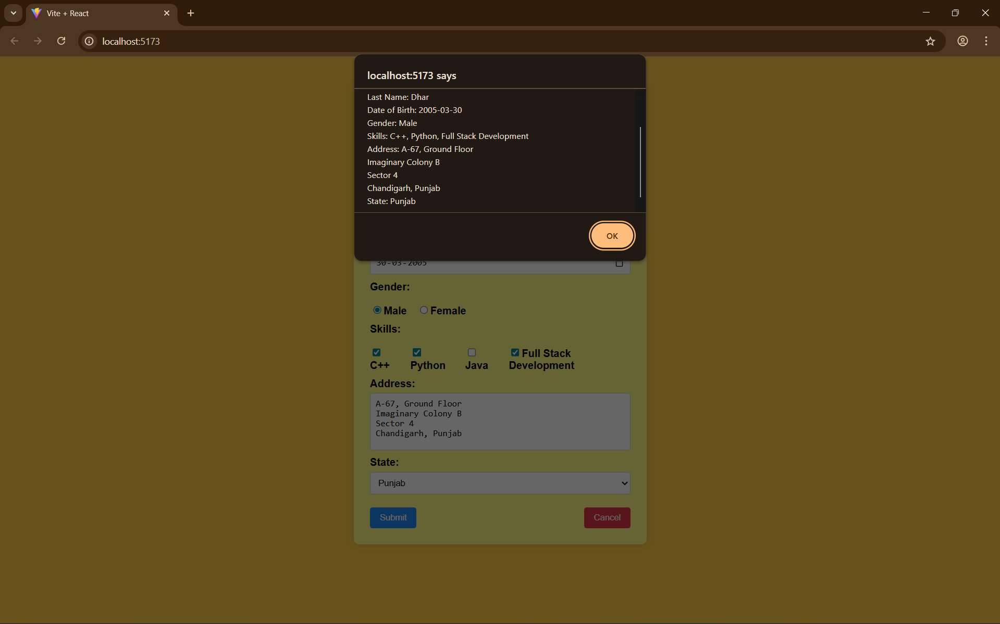
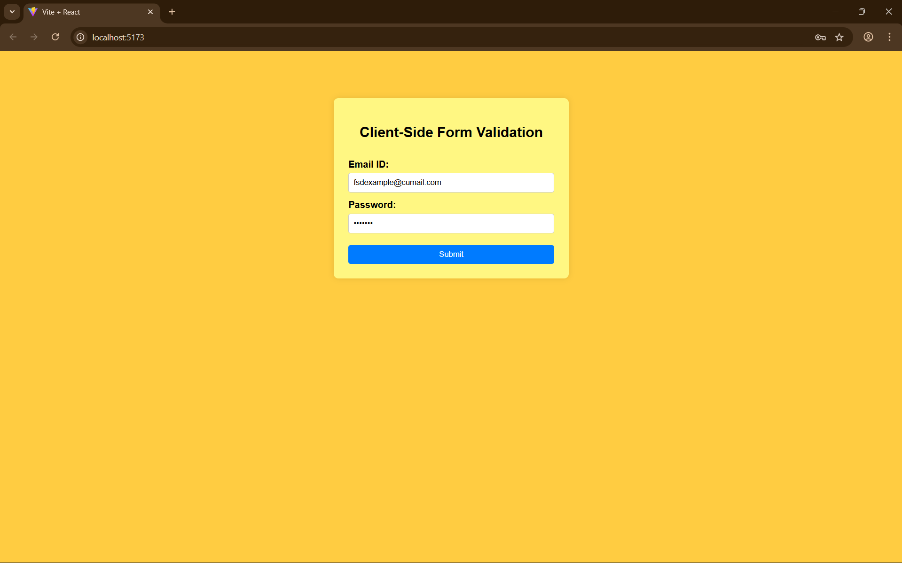
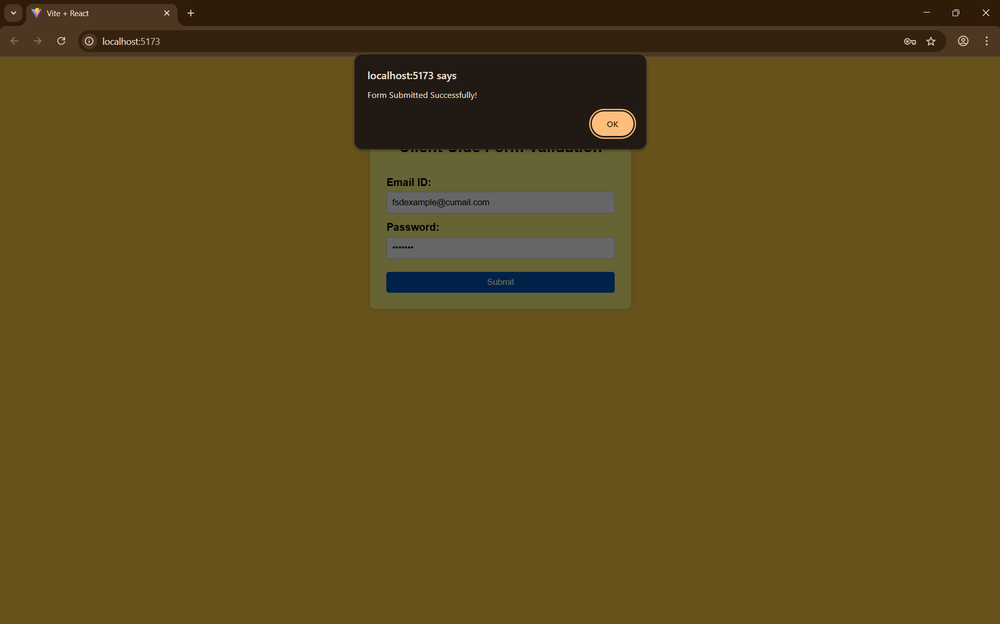

# Experiment 6

## Aim
- To create and handle forms in a frontend application using controlled components in React.
- To validate form inputs on the client side before submission.

## Tools & Libraries
- React (Vite).
- React Router.
- UseState

## Description

### Experiment 6.1

This project demonstrates a form that involves:

- Multiple input fields.
- An alert pop-up on form submission.
- The alert pop-up displays all the details given by the user.

### Experiment 6.2

This project demonstrates a form that involves:

- Two required input fields - email and password.
- Conditions for validations of the email:
    - The email address should have @.
    - The form should except any valid email with any domain name.
- Conditions for validation of the password:
    - The password should begin with a capital letter.
    - The password should have at least one number.
    - The password should have at least one special character.
    . The password should have at least 5 characters.

## Screenshots

### Experiment 6.1

### Experiment 6.2

