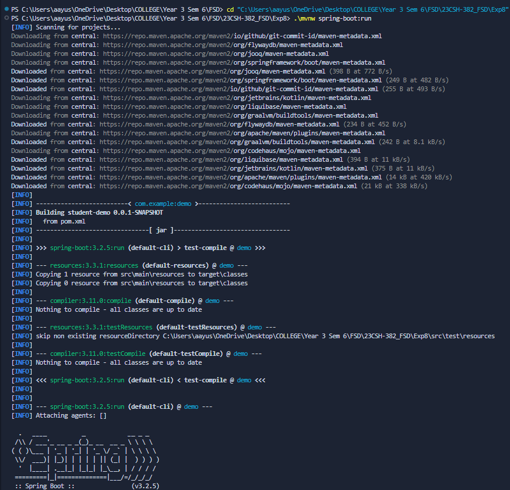
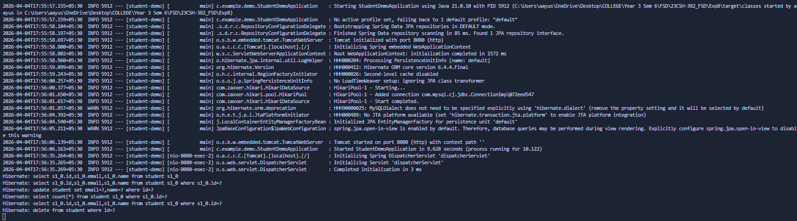
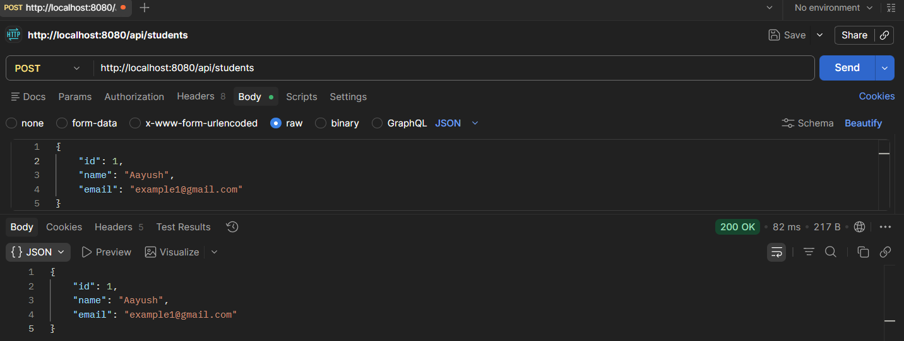
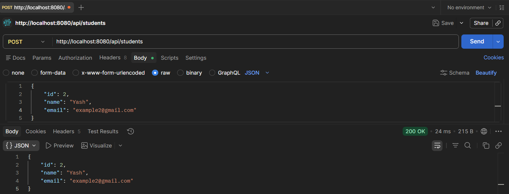
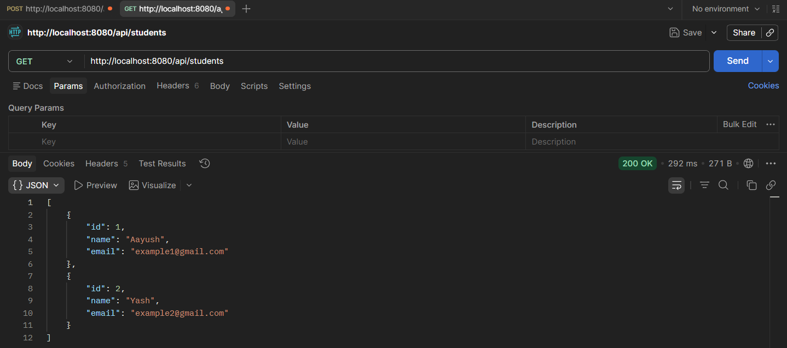
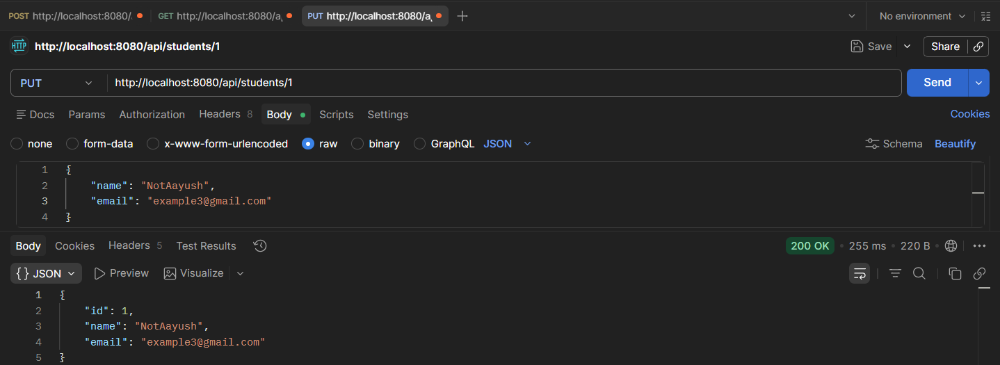
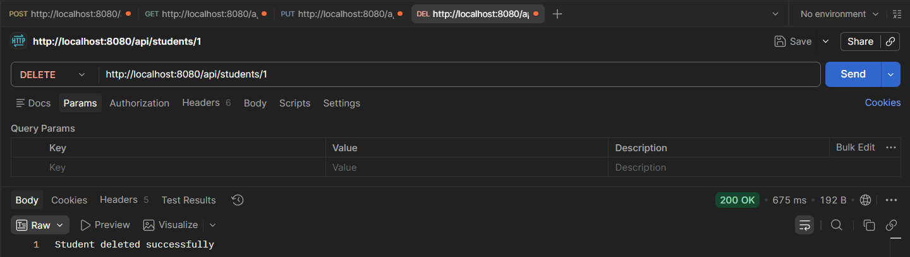

# Experiment 8 - Spring Boot Student CRUD REST API

## Aim
- To build a Spring Boot REST API for Student management with Create, Read, Update, and Delete operations.
- To implement layered architecture with Controller, Service, and Repository layers.
- To integrate JPA/Hibernate ORM with MySQL database for persistent student data storage.
- To demonstrate RESTful API design principles with proper HTTP methods and status codes.
- To practice handling JSON request/response payloads in Spring Boot applications.

## Tools & Libraries
- **Spring Boot** 3.2.0+ (Web, Data JPA, DevTools)
- **Spring Data JPA** with Hibernate ORM
- **MySQL** Database (Connector/J)
- **Maven** (Build tool with Wrapper)
- **Java** 17+ (Compatible with Spring Boot 3.x)
- **Postman** (API Testing Tool)

## Project Structure

```
src/main/java/com/example/demo/
├── StudentDemoApplication.java
├── controller/
│   └── StudentController.java
├── service/
│   └── StudentService.java
├── repository/
│   └── StudentRepository.java
└── model/
    └── Student.java

src/main/resources/
└── application.properties
```

## Description

### Core Features

#### 1. **Student Model**
- Entity class with JPA annotations
- Auto-generated primary key using IDENTITY strategy
- Fields: `id`, `name`, `email`
- Getters and Setters for all properties

#### 2. **Repository Layer**
- `StudentRepository` extends `JpaRepository<Student, Integer>`
- Provides built-in CRUD operations: `save()`, `findAll()`, `findById()`, `deleteById()`, `existsById()`
- No custom queries needed for basic CRUD operations

#### 3. **Service Layer**
- `StudentService` handles business logic
- Methods:
  - `getAllStudents()` - Retrieve all students from database
  - `saveStudent(Student)` - Create or update a student record
  - `getStudentById(int)` - Fetch a specific student by ID
  - `updateStudent(int, Student)` - Modify existing student details
  - `deleteStudent(int)` - Remove a student from database

#### 4. **Controller Layer**
- `StudentController` with `@RequestMapping("/api/students")` base path
- RESTful endpoints for all CRUD operations
- Uses proper HTTP methods (GET, POST, PUT, DELETE)
- Returns JSON responses with appropriate HTTP status codes

#### 5. **Database Configuration**
- MySQL database connection via JDBC
- JPA/Hibernate configuration in `application.properties`
- DDL mode: `update` (auto-creates tables on startup)
- Credentials configured for local MySQL instance

### API Endpoints

| Method | Endpoint | Description | Request Body | Response |
|--------|----------|-------------|--------------|----------|
| GET | `/api/students` | Retrieve all students | None | List of students (JSON array) |
| POST | `/api/students` | Create new student | `{"name": "...", "email": "..."}` | Created student with ID |
| GET | `/api/students/{id}` | Get student by ID | None | Student object (JSON) |
| PUT | `/api/students/{id}` | Update student by ID | `{"name": "...", "email": "..."}` | Updated student object |
| DELETE | `/api/students/{id}` | Delete student by ID | None | Success/failure message |


## Screenshots













