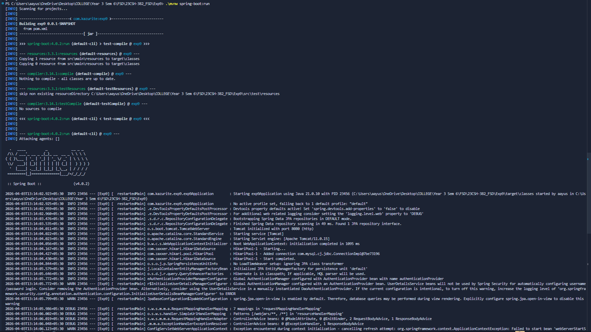
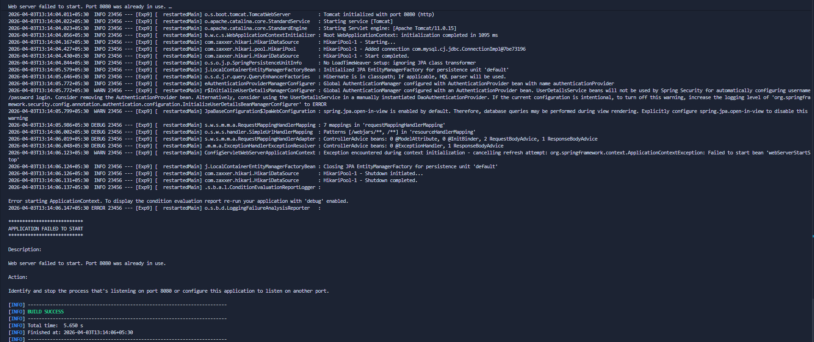
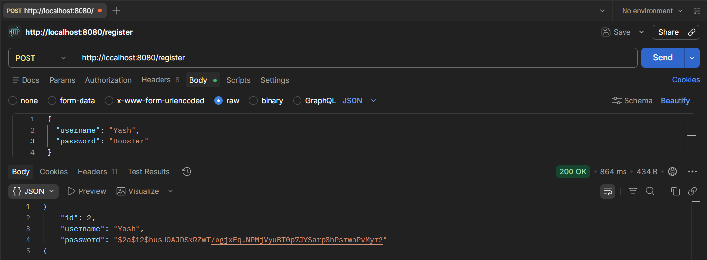
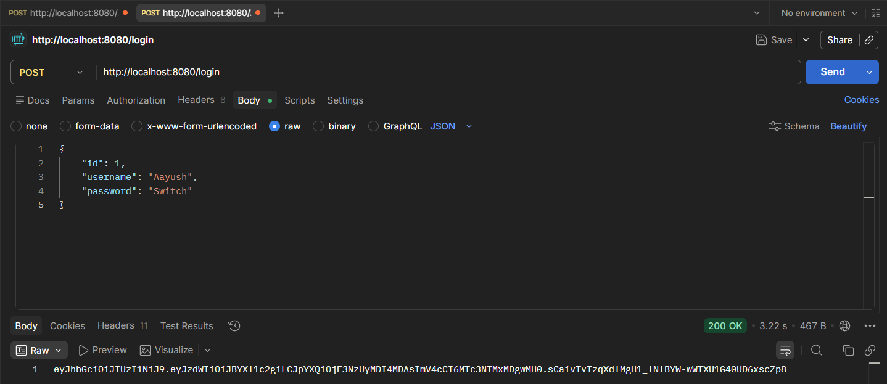
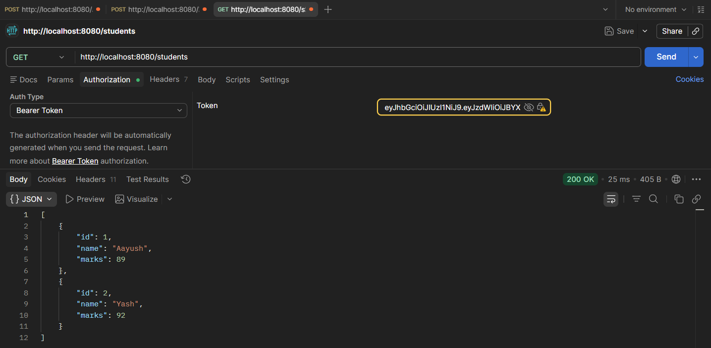

# Experiment 9 - Spring Boot JWT Authentication

## Aim
- To build a comprehensive Spring Boot REST API with JWT-based authentication and authorization.
- To implement user registration and login with password encryption using BCrypt.
- To secure API endpoints using Spring Security and JWT tokens.
- To integrate JPA/Hibernate ORM with MySQL database for persistent user storage.
- To demonstrate role-based security filters and token validation.

## Tools & Libraries
- **Spring Boot** 4.0.2 (Web, Security, Data JPA, DevTools)
- **Spring Security** with JWT (jjwt-api, jjwt-impl, jjwt-jackson 0.13.0)
- **MySQL** (Connector/J)
- **Hibernate** (JPA ORM with DDL auto-schema creation)
- **Lombok** (Annotations for boilerplate code reduction)
- **Maven** (Build tool with Wrapper)
- **Java** 17+ (Compiled with Release 17)

## Project Structure

```
src/main/java/com/kazurite/exp9/
├── exp9Application.java
├── config/
│   └── SecurityConfig.java
├── Controller/
│   ├── UserController.java
│   ├── StudentController.java
│   └── HelloController.java
├── Entity/
│   ├── UserEntity.java
│   ├── UserPrincipal.java
│   └── Student.java
├── Service/
│   ├── UserService.java
│   ├── MyUserDetailService.java
│   └── JwtService.java
├── Repository/
│   └── UserRepository.java
└── Filter/
    └── JwtFilter.java

src/main/resources/
└── application.properties
```

## Description

### Core Features

#### 1. **User Authentication (Register/Login)**
- `POST /register` - Creates a new user with BCrypt-encrypted password
  - Auto-generates user ID (IDENTITY strategy)
  - Stores username and encrypted password in MySQL `tbl_users` table
  
- `POST /login` - Authenticates user and returns JWT token
  - Validates credentials against bcrypted password
  - Generates time-limited JWT (expires in 30 hours)
  - Token includes username as subject claim

#### 2. **JWT Token Handling**
- **Generation**: Signed JWT with HmacSHA256 algorithm
- **Validation**: Checks token expiration and signature
- **Extraction**: Parses username and expiration from claims
- **Filter Chain**: `JwtFilter` validates token on every request
  - Checks Authorization header for "Bearer " prefix
  - Sets authenticated principal in SecurityContext
  - Bypasses filter for public endpoints (`/`, `/register`, `/login`)

#### 3. **Spring Security Configuration**
- CSRF disabled (stateless API)
- Session management in STATELESS mode
- Custom `AuthenticationProvider` with DaoAuthenticationProvider
- BCryptPasswordEncoder with strength 12
- Public endpoints configured via `permitAll()`
- JWT filter added before default UsernamePasswordAuthenticationFilter

#### 4. **Database & ORM**
- MySQL database: `exp9`
- Table: `tbl_users` (auto-created on startup)
- Columns: `id` (auto-increment PK), `username`, `password`
- JPA DDL mode: `create-drop` (recreates tables on each restart)

#### 5. **API Endpoints**

| Method | Endpoint | Auth | Description |
|--------|----------|------|-------------|
| GET | `/` | No | Public greeting with session ID |
| POST | `/register` | No | Register new user |
| POST | `/login` | No | Login and get JWT token |
| GET | `/students` | REQUIRED | Retrieve hardcoded student list |
| POST | `/students` | REQUIRED | Add student to in-memory list |


## Screenshots










